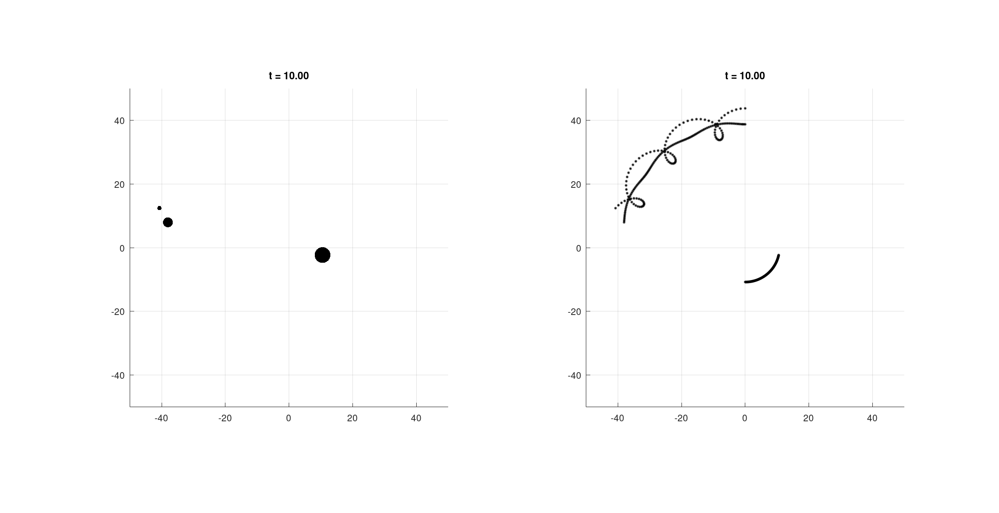

# gravity-simulation

## Introduction

This is an octave script to simulate objects/bodies in a gravitational field. It operates on the
basis of Newton's Law of gravity, Using [euler integration](https://en.wikipedia.org/wiki/Euler_method)
to simulate the motion of each body.

## Using the script

To make use of this script you have to define your environment and the initial positions and
velocities of each body.

All bodies are point particles being defined by only their postion and mass. Though in the
animation you will see the objects are shown as circles, their radius computed on the basis
of their relative mass. (the cube of the radius is taken as proportional to the mass)

You can define the animation in the configuration section of the script. **Do _not_ edit any
other portion of the script** unless you know what you are doing. 

```bash
##----------Start Configuration----------##
#...
#variable definintions here
#...
##----------End Configuration----------##
```

The Most Important Configuration is the definition of the bodies themselves. This is done in
the below format:

```bash
bodies(1).m = 10;           # mass
bodies(1).x = [0,43.761];   # position
bodies(1).v = [-14.359,0];  # velocity

bodies(2).m = 100;          # mass
bodies(2).x = [0,38.761];   # position
bodies(2).v = [-4.409,0];   # velocity
```

The index (the number `n` inside braces in `bodies(n)`), must be increased by one for every
new body you want to define. You must increase them integral order. But otherwise you
can add as many bodies as you like. (If you add to many the simulation can slow down)

Gravitational Constant:

```bash
# The gravitaional constant
global G = 4.5;
```

Plot Controls:
```bash
# axis limits
global lim         = ;
# normal markersize (size of least massive body)
global marker_size = 15;
#trace marker size  (size of the path trace)
global trace_size  = 3;
# frames per unit time
fp_unit            = ;
```

Simulation Accuracy and Time:

```bash
# value of delta t
global delta_t = 0.001;
# simulation time
T              = 10;
```

## Examples

A few interesting examples are provided in the [examples](examples/) directory. You have to copy
paste the configuratuion section given in the text files.



## Improvements

  - Simulation time: The simulation time especially for smaller `delta_t` is too long.
  - Collision: Right now collision causes undefined behaviour. We need to add a collision handler.
  - Documentation: Add some more explaination on the examples given.

## Contributing

If you would like to contribute you can start by a pull request. You can also contact me through
email.